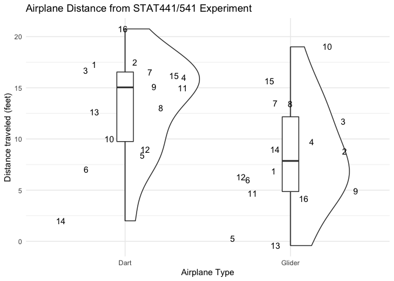

Lab4
================
Key

For this lab we will be starting to think about analyzing our airplane
data. Clean the `Airplane` dataset and recreate a figure similar to lab
2.

``` r
airplane <- read_csv("Airplane.csv")
```

    ## Rows: 16 Columns: 7

    ## ── Column specification ────────────────────────────────────────────────────────
    ## Delimiter: ","
    ## chr (7): Timestamp, First, Dart, Glider, Location, Throwing, Origami

    ## 
    ## ℹ Use `spec()` to retrieve the full column specification for this data.
    ## ℹ Specify the column types or set `show_col_types = FALSE` to quiet this message.

``` r
airplane <- airplane %>% 
  mutate(id = 1:n(), feet_dec = -99) %>% 
  pivot_longer(cols = c(Dart,Glider))
```

### Indirect approach

#### 1. First deal with responses that explicitly state inch measurements

``` r
airplane$feet_dec[str_detect(airplane$value, 'inches')] <-  as.numeric(str_remove(airplane$value[str_detect(airplane$value, 'inches')],'inches'))/12
```

#### 2. Convert feet and inch measurement to feet (decimal)

``` r
airplane$feet_dec[str_detect(airplane$value, '\"')] <-  as.numeric(str_split(airplane$value[str_detect(airplane$value, '\"')],"'", simplify = T)[,1]) + as.numeric(str_split(str_remove(airplane$value[str_detect(airplane$value, '\"')], '\"'),"'", simplify = T)[,2]) / 12
```

#### 3. Strip additional text

``` r
airplane$feet_dec[str_detect(airplane$value, 'feet')] <-  
  as.numeric(str_remove(airplane$value[str_detect(airplane$value, 'feet')], 'feet'))

airplane$feet_dec[str_detect(airplane$value, 'ft linearly')] <-  
  as.numeric(str_remove(airplane$value[str_detect(airplane$value, 'ft linearly')], 'ft linearly'))
```

#### 4. Convert all decimal strings

``` r
airplane$feet_dec[airplane$feet_dec == -99] <-  
  as.numeric(airplane$value[airplane$feet_dec == -99])
```

#### 5. Quality Checks

``` r
airplane$feet_dec[airplane$feet_dec > 26] <-  
airplane$feet_dec[airplane$feet_dec > 26] / 12
```

## Data Visualization

``` r
airplane %>% 
  ggplot(aes(y = feet_dec, x = name, label = id)) +  
  geom_violinhalf() + 
  geom_boxplot(width=0.1) + 
  geom_text(position = position_jitter(seed = 1)) + 
  theme_minimal() + 
  ylab('Distance traveled (feet)') + 
  xlab('Airplane Type') + 
  ggtitle('Airplane Distance from STAT441/541 Experiment')
```


