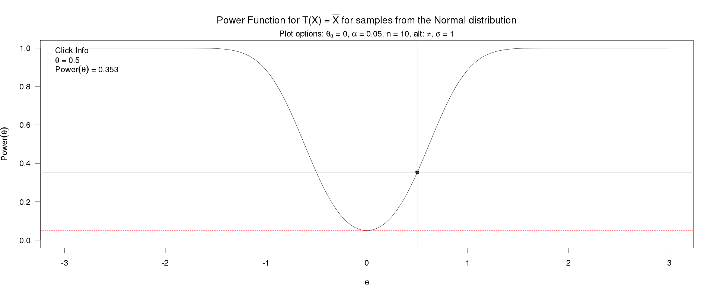

```{r setup, include=FALSE}
knitr::opts_chunk$set(echo = TRUE)
library(tidyverse)
```

This lab will focus on sample size decisions.

## Part 1: Power

#### 1. 
Explore the [Shiny app](https://shiny.stt.msu.edu/jg/powerapp/) created by Christian Stratton and Jenny Green.

Set the following characteristics in the app:

- Population Distribution: __Normal__
- Test Statistic: __Sample Mean__
- Null Value: __0__
- Population standard deviation: __1__
- Alternative Hypothesis: __Not Equal to__
- Alpha Level: __.05__
- Sample Size: __10__
- Theta: __0.5__

The app will generate two figures. Download and attach those figures. I have done the first one for you. Include a short description of the figures.

```{r, fig.align = 'center', out.width = "500px", fig.cap = "This figure shows..." }

```

#### 2.

Write `R` code to calculate the power with the following. Note this can apply to our paired t-test type of experiments.  

- Population Distribution: __Normal__
- Test Statistic: __Sample Mean__
- Null Value: __0__
- Population standard deviation: __1__
- Alternative Hypothesis: __Not Equal to__
- Alpha Level: __.05__
- Sample Size: __10__
- Theta: __0.5__

The sampling distribution for the null hypothesis is 
$$N(\mu_0,  \sigma^2/ r)= N(0,  1/ r)$$

so the critical points are at `qnorm(.025, mean = 0, sd = sqrt(1/10))` = `r qnorm(.025, mean = 0, sd = sqrt(1/10))` and `qnorm(.975, mean = 0, sd = sqrt(1/10))` = `r qnorm(.975, mean = 0, sd = sqrt(1/10))`.


#### 3.

Write `R` code to create a simulation for the power with the following:  

- Population Distribution: __Normal__
- Test Statistic: __Sample Mean__
- Null Value: __0__
- Population standard deviation: __1__
- Alternative Hypothesis: __Not Equal to__
- Alpha Level: __.05__
- Sample Size: __10__
- Theta: __0.5__

The sampling distribution for the null hypothesis is 
$$N(\mu_0,  \sigma^2/ r)= N(0,  1/ r)$$

so the critical points are at `qnorm(.025, mean = 0, sd = sqrt(1/10))` = `r qnorm(.025, mean = 0, sd = sqrt(1/10))` and `qnorm(.975, mean = 0, sd = sqrt(1/10))` = `r qnorm(.975, mean = 0, sd = sqrt(1/10))`.

## Part 2: Uncertainty Bounds

#### 4.

Under the same conditions as above, create a distribution of the estimated standard error ($\frac{\hat{\sigma}}{r}$) and uncertainty interval widths.


#### 5.

Assume you'd like your estimated width of your uncertainty interval to be less than 1. You can also assume that the standard deviation of the data from the pilot study is 4.78 (this is the value from our airplane example). Estimate how many samples will be needed to achieve this precision.
